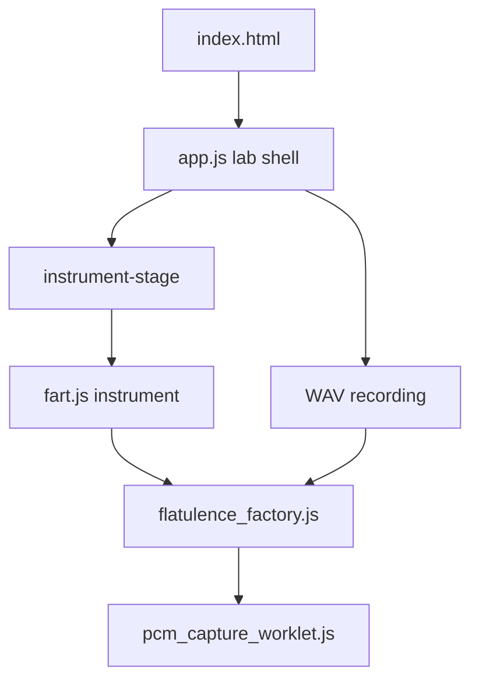

# AGENTS.md — Fart-O-Izer 6000

This file guides **Clankers** (AI agents and automated editors) working on code the **Meat Bags** (human operators) maintain. Meat Bags read it too. Clankers must follow it when changing this repository.

User-facing documentation lives in [README.md](README.md).

---

## Terminology

| Term | Meaning |
|------|---------|
| **Clanker** / **Clankers** | Any AI assistant, agent, or automated editor |
| **Meat Bag** / **Meat Bags** | Human operators, contributors, and dev-workflow users |

**Rules for Clankers**

- Use **Clanker** / **Clankers** and **Meat Bag** / **Meat Bags** in this file, in new comments where natural, and in commit or PR text when the Meat Bag uses that voice.
- Do not refer to Clankers as "AI", "the assistant", "LLM", or similar in agent-facing docs or comments governed by this file.
- Do not rewrite existing comments or docs solely to swap terminology.

---

## Project snapshot

Fart-O-Izer 6000 is a **fully client-side** atmospheric sound lab: HTML, CSS, and the Web Audio API. No samples, no build step, no npm, no backend. The app is a shared **lab shell** that hosts self-contained **instruments** — today the **Fart** synthesizer; more can plug in later without changing the page URL or recording flow.

**Constraints Clankers must respect**

- Static hosting only (e.g. GitHub Pages; see [CNAME](CNAME)).
- Web Audio `AudioContext` must start from a **user gesture** (first press/play).
- Fonts may load from a CDN; all audio synthesis and UI logic runs in the browser.
- No new package managers or build pipelines without explicit Meat Bag approval.

---

## Architecture



### Layers and ownership

| Layer | Path | Owns |
|-------|------|------|
| **Shell** | [app.js](app.js) | Status line, advanced panel, WAV recording, instrument registry, shared lab chrome |
| **Instrument** | [instruments/&lt;id&gt;/&lt;id&gt;.js](instruments/fart/fart.js) | Play surface, settings model, share URL, control wiring, `mount` API |
| **Instrument styles** | [instruments/&lt;id&gt;/&lt;id&gt;.css](instruments/fart/fart.css) | Play surface and control styling for that instrument |
| **Audio engine** | e.g. [flatulence_factory.js](instruments/fart/flatulence_factory.js) | Web Audio graph, envelopes, scheduling, master gain — no DOM |
| **Shared worklet** | [pcm_capture_worklet.js](pcm_capture_worklet.js) | Mono PCM tap for WAV capture (repo root) |

The shell mounts instruments into `#instrument-stage` (play surface) and `#instrument-controls` (advanced sliders). It talks to the active instrument through a small plug-in API — **never** directly to internal Web Audio nodes.

### Instrument plug-in contract

Each instrument exposes an object (e.g. `window.FartInstrument`) registered in the `instruments` map in [app.js](app.js).

**Required methods**

| Method | Purpose |
|--------|---------|
| `mount({ setStatus })` | Wire DOM, create audio engine, decode share URL if present |
| `getAudio()` | Return the audio engine/factory handle used for recording |
| `share()` | Encode settings into the page URL and copy/share |
| `reset()` | Restore default settings and sync UI |
| `getGain()` | Current master gain (used when arming capture) |

**Optional methods**

| Method | Purpose |
|--------|---------|
| `onPanelOpen()` | Refresh or focus controls when the advanced panel opens |

**Recommended metadata** (for registry / future multi-instrument UI)

| Field | Purpose |
|-------|---------|
| `id` | Short registry key (e.g. `fart`) |
| `displayName` | Human label (e.g. `Fart`) |

**Audio engine surface (via `getAudio()`)**

The shell expects the returned factory to support capture and level metering for recording:

- `startCapture(gain)` — arm worklet tap
- `stopCapture()` — flush PCM; returns `{ samples, sampleRate }`
- `getRMS()` — current output level (silence detection)

Instrument-specific playback APIs (e.g. Fart: `start`, `stop`, `play`, `setGain`) stay on the factory; the shell does not call them directly.

### Boot flow (shell)

```
initialize()
  → activeInstrument = instruments.fart()
  → activeInstrument.mount({ setStatus })
  → wire Record, Share, Controls, panel handlers
```

### Runtime flow (shell)

```
Record         → countdown → capture via activeInstrument.getAudio()
Share          → activeInstrument.share()
Reset          → activeInstrument.reset()
Controls open  → activeInstrument.onPanelOpen() (if provided)
```

---

## Documentation requirements

**Mandatory when Clankers touch JavaScript** — especially `instruments/**` and `*worklet*.js`.

### 1. File header block

Every major JS file must open with a multi-line `/* ... */` comment that includes:

- What the file **owns** (single responsibility)
- **Boot flow** — who calls whom at initialization
- **Runtime flow** — user actions, events, and callbacks
- For audio engines: **signal chain** or graph in prose (sources → gains → filter → output)
- **Exported public API** list when the file exports functions or factory methods

### 2. Section comments

Use `// --- Section name ---` for logical blocks (see [app.js](app.js), [fart.js](instruments/fart/fart.js)).

### 3. Non-obvious audio logic

Comment scheduling, envelope ramps, worklet handshake, lazy `AudioContext` creation, node disconnect timing, and worklet processor name strings that must match `AudioWorkletNode` registration.

### 4. Tone and noise

- Clarity first; dry humor is allowed and matches the repo voice.
- Do **not** comment obvious code.
- Do **not** strip flow comments to "clean up" a file.

### Gold-standard references

Mirror these when adding or editing audio-related code:

- [instruments/fart/flatulence_factory.js](instruments/fart/flatulence_factory.js) — signal chain, factory API, scheduling
- [instruments/fart/fart.js](instruments/fart/fart.js) — instrument boot/runtime, FartID sharing
- [pcm_capture_worklet.js](pcm_capture_worklet.js) — worklet capture handshake

---

## Repository layout

```text
index.html                          Lab shell (masthead, console, actions, recording)
style.css                           Shared layout, tokens, panel chrome, recording UI
app.js                              Lab controller — recording, panels, instrument mounting
pcm_capture_worklet.js              Shared WAV capture worklet (repo root)
instruments/fart/
  fart.js                           Fart instrument — settings, FartID, hold/release, controls
  fart.css                          Fart play surface and control styling
  flatulence_factory.js             Flatulence Factory Web Audio engine
img/                                Mascot and background assets
docs/                               Design notes (not runtime): PLAN.txt, PLAN_RECORDING.txt, FONTS.md
colorscheme.toml                    Color scheme reference (not loaded at runtime)
```

---

## Local development

Serve the project directory with any static file server. Do not invent build tooling.

```text
python -m http.server 8000
```

Open `http://localhost:8000/` and press **FART**. Browsers require the first audio context to start from a user gesture.

---

## Change guidelines for Clankers

- **Minimize scope** — smallest correct diff; match existing IIFE + `'use strict'` style.
- **New instruments** — add `instruments/<id>/<id>.js` and `<id>.css`; register in `app.js` `instruments` map; implement the plug-in contract above.
- **Recording** — must tap the factory master output via [pcm_capture_worklet.js](pcm_capture_worklet.js); never use the microphone.
- **FartID / share encoding** — preserve URL compatibility; see `VERSION`, `keys`, and `PARAMETER` in [fart.js](instruments/fart/fart.js).
- **Worklet path** — `pcm_capture_worklet.js` is loaded from the repo root relative to the page URL.
- **Dependencies** — no npm or new CDN scripts without explicit Meat Bag approval.

---

## What Clankers should not do

- Add build pipelines, bundlers, or package managers silently
- Bypass the instrument API from the shell
- Remove or thin out flow-documenting comments
- Commit secrets or change git config
- Break existing share links on the site root after refactors

---

## Expansion placeholders (TODO)

Sections for Meat Bags and Clankers to grow over time:

### Testing strategy

> **TODO:** Document manual browser test checklist (hold/release, recording, silence stop, 60s max, FartID round-trip, unsupported browser messages).

### New instrument checklist

> **TODO:** DOM ids in `index.html`, CSS scope, factory isolation, registry entry, recording compatibility, share parameter naming.

### CSS and design tokens

> **TODO:** How [colorscheme.toml](colorscheme.toml) relates to [style.css](style.css); instrument-specific vs shared chrome.

### Accessibility

> **TODO:** Keyboard hold on FART, panel `aria-*`, focus management (`onPanelOpen`), recording button states.

### Browser support matrix

> **TODO:** Web Audio, `AudioWorklet`, pointer capture; graceful degradation paths.

### Release and deploy

> **TODO:** GitHub Pages flow, [CNAME](CNAME), asset cache busting if needed.
